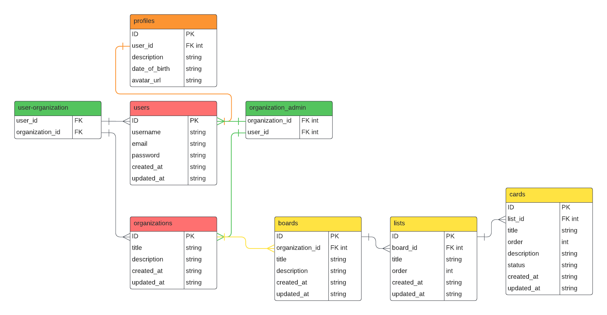

# Sprinty API ✅

## Overview

Sprinty API is a Fastify-based server that provides OAuth2 authentication using GitHub. It allows users to log in with their GitHub account, fetch user data, and log out.

## Features

- GitHub OAuth2 authentication
- Fetch GitHub user data
- User login and logout

## Setup

### Prerequisites

- Node.js (v14 or higher)
- npm or yarn
- GitHub OAuth2 credentials (Client ID and Client Secret)

### Environment Variables

Set up environment variables for GitHub OAuth2 credentials.

### Database Migration and Seeding

To run the database migrations and seed the database, use the following scripts:

```sh
    npm run knex:migrate
    npm run knex:seed
```

### Schema Diagram



#### Database Schema

Tables:
- organizations
- users
- boards
- lists
- cards
- organization_admin
- user_organization
- profiles

### Running the Server

To start the server, use:

```sh
npm start
# or
yarn start
```